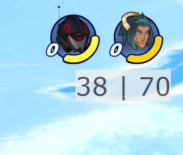
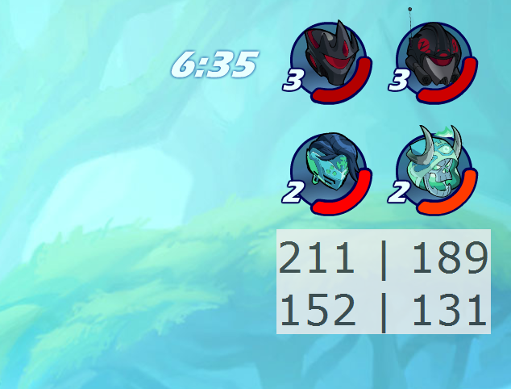

# Brawlhalla Health HUD v2.0

This is an open-source Java application that can overlay the health of your opponents onto your screen. Since dll injection in Java isn't really a thing, it achieves this by making itself an "always on top" window, and tricking windows into thinking a fullscreen application is on the top.

This ia a complete recode over the original Brawlhalla Health HUD (referred to as BHH from here on out), because the original was made very hastily, with an atrocious switch statement to get health from color, using the `getPixelColor` which is extremely slow in Java, and generally not being written with any kind of expandability in mind.

this version runs faster due to the replacement of `getPixelColor`, is coded much cleaner, has a nicer UI, and has native builds (compiled with Excelsior JET).

## You can terminate the program by pressing F2.

#[All-downloads](https://bitbucket.org/BFCEHF/brawlhalla-health-hud-v2.0/downloads/)

#[Java Download](https://bitbucket.org/BFCEHF/brawlhalla-health-hud-v2.0/downloads/BHH2.jar)

#[Native-download](https://bitbucket.org/BFCEHF/brawlhalla-health-hud-v2.0/downloads/BHH2-native.7z)